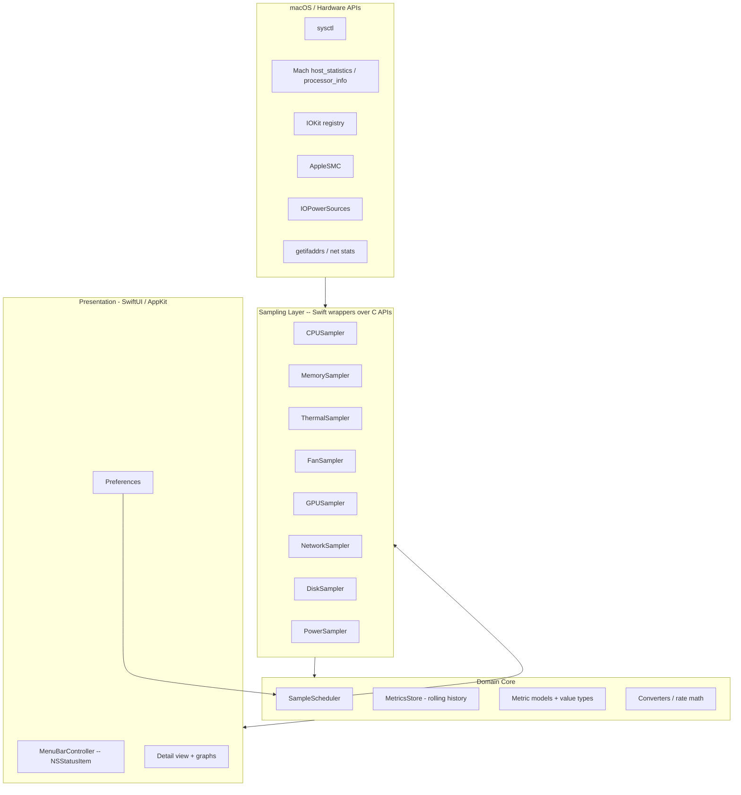

# iStats — Technical Design

## Overview

iStats is a native macOS menu bar application that samples system telemetry on background threads and renders it in a compact menu bar item plus a richer detail view. The design isolates all OS-specific, hardware-touching code behind a small set of protocols so that:

- The OS-specific code (the hard, unfamiliar part) is concentrated and replaceable.
- The domain model and presentation layers stay pure and unit-testable.
- A failure reading one sensor cannot crash the app or stop other metrics.

This document also defines the **learning and documentation architecture** (ADRs, docs set, phased plan, prerequisites guide) that the user requested as first-class deliverables.

---

## Architecture

### High-level layers



### Component responsibilities

| Layer | Responsibility | Testable without hardware? |
|-------|----------------|----------------------------|
| Sampling | Wrap C/Obj-C system APIs; return raw typed readings | No (integration-tested on device) |
| Domain Core | Scheduling, rate math, unit conversion, rolling history, enable/disable | **Yes** — pure Swift |
| Presentation | Menu bar item, detail view, graphs, preferences | Partially (view models testable) |

### Threading model

- A single `SampleScheduler` owns a background queue (or async tasks) and triggers each enabled sampler at its interval.
- Samplers run **off the main thread**. Results are published to the main actor (e.g., via `@MainActor` view models / Combine `@Published` or `AsyncStream`).
- Each sampler call is wrapped so a thrown error or timeout marks that metric `.unavailable` for the cycle without affecting others (Requirement 12.3).

---

## Mapping metrics to macOS APIs (the OS learning map)

This table is the heart of the design and doubles as a study guide. Each row gets an ADR if the choice is non-obvious.

| Metric | Primary API | Notes / risk |
|--------|-------------|--------------|
| CPU total/per-core | Mach `host_processor_info(PROCESSOR_CPU_LOAD_INFO)` | Compute deltas between samples for % |
| Load average | `sysctl` (`vm.loadavg`) | Straightforward |
| CPU frequency | `sysctl` (`hw.cpufrequency`* / Apple Silicon limits) | May be unavailable on Apple Silicon; mark unavailable |
| Memory | Mach `host_statistics64(HOST_VM_INFO64)` + `sysctl hw.memsize` | Page size from `host_page_size` |
| Memory pressure | `DispatchSource` memory pressure / `sysctl` | Map to normal/warning/critical |
| Swap | `sysctl vm.swapusage` | Struct decode |
| Temperatures | AppleSMC via IOKit (read SMC keys) **or** IOReport/`IOHID` energy sensors | Hardest part on Apple Silicon; SMC keys differ. ADR required |
| Fans | AppleSMC keys (FNum, F0Ac, etc.) | Control likely needs privileged helper; default read-only |
| GPU | IOKit (`IOAccelerator`/`AGXAccelerator`) performance statistics | Keys vary by GPU; mark unavailable when absent |
| Network | `getifaddrs` + `if_data` byte counters | Rate = delta bytes / delta time; handle counter reset |
| Disk capacity | `FileManager`/`statfs` per volume | Enumerate mounted volumes |
| Disk I/O | IOKit (`IOBlockStorageDriver` statistics) | Optional in early phases |
| Battery / power | IOKit `IOPowerSources` + `AppleSmartBattery` registry; SMC power keys | Cycle count, condition, design capacity from registry; wattage from SMC/IOReport |

**Key design risk:** Thermal/fan/power-via-SMC is the least documented and most fragile area, especially on Apple Silicon. The design deliberately phases these later (see phase plan) and always allows `.unavailable`.

---

## Data model

```swift
// Value types — pure, testable
struct Sample<T> { let value: T; let timestamp: Date; let availability: Availability }
enum Availability { case available, unavailable(reason: String) }

struct CPUSample { let totalUsage: Double; let perCore: [Double]
                   let user: Double; let system: Double; let idle: Double }
struct MemorySample { let total, used, free, wired, compressed, cached, swapUsed: UInt64
                      let pressure: MemoryPressure }
struct ThermalSample { let sensors: [SensorReading] }       // name + °C
struct FanSample { let fans: [FanReading] }                  // rpm, min, max
struct NetworkSample { let interfaces: [InterfaceThroughput] } // up/down bytes/s + totals
// ... Disk, GPU, Power analogous

protocol Sampler {
    associatedtype Output
    var category: MetricCategory { get }
    func sample() throws -> Output      // runs off main thread
}
```

### Rolling history

`MetricsStore` keeps a fixed-capacity ring buffer per category (e.g., last N minutes) for the detail-view graphs (Requirement 10.2). Pure in-memory; no persistence of telemetry (privacy — Requirement 13.3). Only **preferences** are persisted.

---

## Rate & conversion math (pure, unit-tested)

- **CPU %**: `(deltaBusy / deltaTotal) * 100` per core, where busy/total come from cumulative tick counters.
- **Network rate**: `(bytesNow - bytesPrev) / (tNow - tPrev)`; if `bytesNow < bytesPrev` (counter reset/interface restart) → treat delta as 0 for that cycle, never negative (Requirement 6.4).
- **Unit conversion**: °C↔°F, bytes↔bits, IEC vs SI byte units. Pure functions with property tests.

---

## Presentation

- **MenuBarController** owns an `NSStatusItem`. Configurable: which metric(s) render in the bar (Requirement 9.4); app can run without a Dock icon via `LSUIElement` (Requirement 9.5).
- **Detail view** (SwiftUI in an `NSPopover` or window) shows all enabled categories with live values and rolling graphs.
- **Preferences** (SwiftUI window): toggle categories, set interval (bounded), choose units, launch-at-login (`SMAppService`).
- View models are `@MainActor` and consume an `AsyncStream`/`@Published` feed from the scheduler, keeping views off the sampling threads.

---

## Error handling & resilience

- Each scheduler tick wraps `sampler.sample()` in a do/catch; on error it emits `Sample(... availability: .unavailable(reason))` and logs.
- Per-sampler watchdog: if a read exceeds a time budget, skip this cycle.
- No force-unwrapping of system call results; all `kern_return_t`/IOKit results checked.

---

## Permissions, entitlements, privilege

- Most reads (CPU, memory, network, disk capacity, battery via IOPowerSources) need **no special entitlement**.
- SMC reads, fan control, and some IOKit stats may require additional access or, for control, a **privileged helper tool** (`SMAppService`/`launchd` daemon). Default posture: **read-only, no privilege escalation**; fan control gated behind an explicit ADR and opt-in (Requirements 4.3, 13.2).
- App Sandbox: starting non-sandboxed for development (many sensors are blocked in the sandbox); sandboxing tradeoffs captured in an ADR.

---

## Project structure (skeleton)

```
iStats/
├── README.md
├── docs/
│   ├── overview.md
│   ├── architecture.md
│   ├── build-and-run.md
│   ├── glossary.md
│   ├── prerequisites-and-learning.md     # "what I need to learn" + how to validate each metric
│   ├── adr/
│   │   ├── 0001-language-and-ui-stack.md
│   │   ├── 0002-threading-and-scheduling-model.md
│   │   ├── 0003-thermal-fan-data-source.md
│   │   ├── 0004-privilege-and-fan-control.md
│   │   ├── 0005-sandbox-and-entitlements.md
│   │   └── 0006-telemetry-privacy-no-persistence.md
│   └── phases/
│       ├── phase-plan.md                  # whole-project skeleton + phase index
│       ├── phase-01-foundation/{tasks.md,report.md}
│       ├── phase-02-cpu-memory/{tasks.md,report.md}
│       ├── phase-03-network-disk/{tasks.md,report.md}
│       ├── phase-04-battery-power/{tasks.md,report.md}
│       ├── phase-05-thermal-fan-gpu/{tasks.md,report.md}
│       └── phase-06-polish-prefs/{tasks.md,report.md}
├── iStats/            # app target (Swift, SwiftUI/AppKit)
│   ├── App/           # entry point, MenuBarController
│   ├── Core/          # SampleScheduler, MetricsStore, models, converters (pure)
│   ├── Sampling/      # one file per Sampler, wrapping C/IOKit APIs
│   ├── UI/            # detail view, graphs, preferences
│   └── Resources/
└── iStatsTests/       # unit tests for Core (rate math, conversions, history)
```

---

## Phased delivery plan (skeleton)

Each phase ends with a working, runnable app and a `report.md` capturing what was learned and how it was validated.

1. **Phase 1 — Foundation:** Xcode project, menu bar skeleton, `LSUIElement`, scheduler + protocols, preferences shell, test harness. *Learning: app lifecycle, menu bar, threading.*
2. **Phase 2 — CPU & Memory:** Mach host stats, per-core %, memory + pressure. *Learning: Mach, sysctl, delta math.* Validate vs Activity Monitor / `top`.
3. **Phase 3 — Network & Disk:** throughput via `getifaddrs`, capacity via `statfs`. Validate vs Activity Monitor network tab / `df`.
4. **Phase 4 — Battery & Power:** IOPowerSources + AppleSmartBattery registry; wattage. Validate vs `pmset -g batt` / coconutBattery concepts.
5. **Phase 5 — Thermal, Fan, GPU:** SMC reads, fan RPM (read-only first), GPU stats. *Highest risk.* Validate vs `powermetrics`/`sudo powermetrics`.
6. **Phase 6 — Polish & Preferences:** unit options, configurable bar content, launch-at-login, history graphs, performance tuning.

---

## Testing strategy

- **Pure core (unit + property tests):** CPU % from synthetic tick counters; network rate including counter-reset edge cases (never negative); unit conversions round-trip; ring buffer capacity/eviction.
- **Sampler integration tests (on device):** sanity ranges (CPU 0–100%, memory ≤ physical, RPM within reported bounds), and `.unavailable` handling when a key is absent.
- **Validation harness:** the prerequisites doc lists, per metric, a reference command (Activity Monitor, `top`, `df`, `pmset`, `powermetrics`) to cross-check values — this is both QA and a learning aid.

---

## Key design decisions (to become ADRs)

1. Swift + SwiftUI/AppKit native (vs Tauri/Electron) — chosen for OS learning and full API access.
2. Background scheduler with per-sampler isolation — resilience + low footprint.
3. Thermal/fan/power data source (SMC vs IOReport) — to be settled with on-device experiments in Phase 5.
4. Read-only by default; fan control behind privileged helper + opt-in.
5. Non-sandboxed for development; document sandbox tradeoffs.
6. No telemetry persistence; preferences-only storage; data never leaves device.
