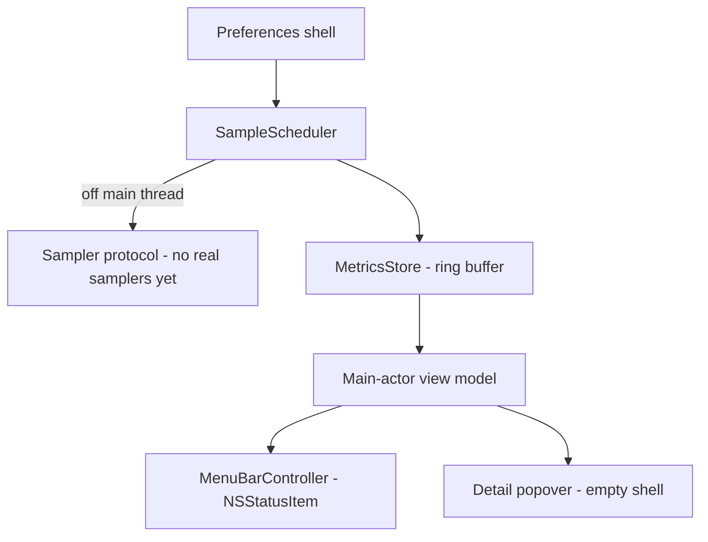

# Phase 1 — Foundation — Design

The slice of the architecture this phase builds. See the top-level
[`design.md`](../../specs/design.md) for the complete design.

## What this phase establishes



## Core protocols & value types (Task 1.3)

```swift
struct Sample<T> { let value: T; let timestamp: Date; let availability: Availability }
enum Availability { case available, unavailable(reason: String) }
enum MetricCategory { case cpu, memory, network, disk, battery, thermal, fan, gpu }

protocol Sampler {
    associatedtype Output
    var category: MetricCategory { get }
    func sample() throws -> Output      // runs off the main thread
}
```

## SampleScheduler (Task 1.4)

- Owns a background queue (or async tasks); triggers each enabled sampler at its interval.
- Each `sampler.sample()` call is wrapped in do/catch; on error or timeout it emits
  `.unavailable(reason)` for that cycle and continues the others (Requirement 12.3).
- Publishes results to the main actor for the UI.

## MetricsStore (Task 1.5)

- Fixed-capacity ring buffer **per category** (last N minutes).
- Pure, in-memory, no persistence of telemetry (privacy — ADR 0006).
- Unit-tested for capacity and eviction.

## Presentation shell (Tasks 1.1, 1.2)

- `LSUIElement` so the app runs without a Dock icon (configurable later).
- `MenuBarController` installs an `NSStatusItem` with a placeholder; clicking opens an
  empty SwiftUI detail popover.

## Preferences shell (Task 1.6)

- SwiftUI preferences window backed by a persisted settings store.
- Wire the refresh-interval bounds (min/max) now; category toggles and unit options come
  in Phase 6.

## Threading rule (Requirement 12.1)

All sampling happens off the main thread; view models are `@MainActor` and consume a
published feed from the scheduler.
