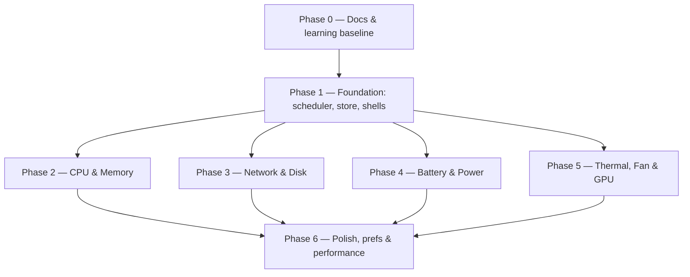

# Implementation Plan

## Overview

The implementation plan is organized by phase. Each phase is now a self-contained spec
under [`phases/`](../phases/) with its own `requirements.md`, `design.md`, and a `tasks/`
folder holding one file per task (each task file states **what to do** and its **goal**).

This top-level document is the index and dependency map. The per-phase folders hold the
detail. The whole-project [`requirements.md`](./requirements.md) and
[`design.md`](./design.md) remain the canonical source of truth.

Each phase ends with a runnable app (from Phase 1 on) and a written `report.md`.

## Tasks

### Phase 0 — Documentation scaffolding & learning baseline ([folder](../phases/phase-00-documentation/))
- [ ] 0.1 Create project + documentation folder structure
  - Detail: [`tasks/0.1-folder-structure.md`](../phases/phase-00-documentation/tasks/0.1-folder-structure.md)
- [ ] 0.2 Write the prerequisites & learning guide
  - Detail: [`tasks/0.2-prerequisites-learning.md`](../phases/phase-00-documentation/tasks/0.2-prerequisites-learning.md)
- [ ] 0.3 Write the core documentation set
  - Detail: [`tasks/0.3-docs-set.md`](../phases/phase-00-documentation/tasks/0.3-docs-set.md)
- [ ] 0.4 Write the phase plan and per-phase stubs
  - Detail: [`tasks/0.4-phase-plan-stubs.md`](../phases/phase-00-documentation/tasks/0.4-phase-plan-stubs.md)
- [ ] 0.5 Author the initial ADRs
  - Detail: [`tasks/0.5-initial-adrs.md`](../phases/phase-00-documentation/tasks/0.5-initial-adrs.md)

### Phase 1 — Foundation ([folder](../phases/phase-01-foundation/))
- [ ] 1.1 Create the Swift app target with LSUIElement
  - Detail: [`tasks/1.1-app-target-lsuielement.md`](../phases/phase-01-foundation/tasks/1.1-app-target-lsuielement.md)
- [ ] 1.2 Install the status item and detail popover
  - Detail: [`tasks/1.2-statusitem-popover.md`](../phases/phase-01-foundation/tasks/1.2-statusitem-popover.md)
- [ ] 1.3 Define core protocols and value types
  - Detail: [`tasks/1.3-core-protocols-types.md`](../phases/phase-01-foundation/tasks/1.3-core-protocols-types.md)
- [ ] 1.4 Implement the SampleScheduler
  - Detail: [`tasks/1.4-sample-scheduler.md`](../phases/phase-01-foundation/tasks/1.4-sample-scheduler.md)
- [ ] 1.5 Implement the MetricsStore ring buffer
  - Detail: [`tasks/1.5-metrics-store-ringbuffer.md`](../phases/phase-01-foundation/tasks/1.5-metrics-store-ringbuffer.md)
- [ ] 1.6 Build the preferences shell
  - Detail: [`tasks/1.6-preferences-shell.md`](../phases/phase-01-foundation/tasks/1.6-preferences-shell.md)
- [ ] 1.7 Write the Phase 1 report
  - Detail: [`tasks/1.7-phase-report.md`](../phases/phase-01-foundation/tasks/1.7-phase-report.md)

### Phase 2 — CPU & Memory ([folder](../phases/phase-02-cpu-memory/))
- [ ] 2.1 Implement CPUSampler (total + per-core)
  - Detail: [`tasks/2.1-cpu-sampler.md`](../phases/phase-02-cpu-memory/tasks/2.1-cpu-sampler.md)
- [ ] 2.2 Load average and CPU frequency
  - Detail: [`tasks/2.2-loadavg-frequency.md`](../phases/phase-02-cpu-memory/tasks/2.2-loadavg-frequency.md)
- [ ] 2.3 Property tests for CPU % math
  - Detail: [`tasks/2.3-cpu-math-tests.md`](../phases/phase-02-cpu-memory/tasks/2.3-cpu-math-tests.md)
- [ ] 2.4 Implement MemorySampler
  - Detail: [`tasks/2.4-memory-sampler.md`](../phases/phase-02-cpu-memory/tasks/2.4-memory-sampler.md)
- [ ] 2.5 Memory pressure level + UI surfacing
  - Detail: [`tasks/2.5-memory-pressure.md`](../phases/phase-02-cpu-memory/tasks/2.5-memory-pressure.md)
- [ ] 2.6 Render CPU + memory in the detail view
  - Detail: [`tasks/2.6-detail-view-graphs.md`](../phases/phase-02-cpu-memory/tasks/2.6-detail-view-graphs.md)
- [ ] 2.7 Validate vs reference tools + Phase 2 report
  - Detail: [`tasks/2.7-validate-and-report.md`](../phases/phase-02-cpu-memory/tasks/2.7-validate-and-report.md)

### Phase 3 — Network & Disk ([folder](../phases/phase-03-network-disk/))
- [ ] 3.1 Implement NetworkSampler
  - Detail: [`tasks/3.1-network-sampler.md`](../phases/phase-03-network-disk/tasks/3.1-network-sampler.md)
- [ ] 3.2 Network rate math with counter-reset handling
  - Detail: [`tasks/3.2-rate-math-counter-reset.md`](../phases/phase-03-network-disk/tasks/3.2-rate-math-counter-reset.md)
- [ ] 3.3 Disk capacity per volume
  - Detail: [`tasks/3.3-disk-capacity.md`](../phases/phase-03-network-disk/tasks/3.3-disk-capacity.md)
- [ ] 3.4 Disk I/O throughput
  - Detail: [`tasks/3.4-disk-io.md`](../phases/phase-03-network-disk/tasks/3.4-disk-io.md)
- [ ] 3.5 Network/disk in detail view + bytes/bits option
  - Detail: [`tasks/3.5-detail-view-units.md`](../phases/phase-03-network-disk/tasks/3.5-detail-view-units.md)
- [ ] 3.6 Validate vs reference tools + Phase 3 report
  - Detail: [`tasks/3.6-validate-and-report.md`](../phases/phase-03-network-disk/tasks/3.6-validate-and-report.md)

### Phase 4 — Battery & Power ([folder](../phases/phase-04-battery-power/))
- [ ] 4.1 PowerSampler: charge / state / time remaining
  - Detail: [`tasks/4.1-power-sampler-charge.md`](../phases/phase-04-battery-power/tasks/4.1-power-sampler-charge.md)
- [ ] 4.2 Battery health metrics
  - Detail: [`tasks/4.2-battery-health.md`](../phases/phase-04-battery-power/tasks/4.2-battery-health.md)
- [ ] 4.3 Instantaneous power draw / wattage
  - Detail: [`tasks/4.3-power-draw-wattage.md`](../phases/phase-04-battery-power/tasks/4.3-power-draw-wattage.md)
- [ ] 4.4 Handle the no-battery case
  - Detail: [`tasks/4.4-no-battery-case.md`](../phases/phase-04-battery-power/tasks/4.4-no-battery-case.md)
- [ ] 4.5 Validate vs reference tools + Phase 4 report
  - Detail: [`tasks/4.5-validate-and-report.md`](../phases/phase-04-battery-power/tasks/4.5-validate-and-report.md)

### Phase 5 — Thermal, Fan & GPU ([folder](../phases/phase-05-thermal-fan-gpu/))
- [ ] 5.1 Spike + ADR 0003: thermal/fan data source
  - Detail: [`tasks/5.1-spike-adr-data-source.md`](../phases/phase-05-thermal-fan-gpu/tasks/5.1-spike-adr-data-source.md)
- [ ] 5.2 Implement ThermalSampler
  - Detail: [`tasks/5.2-thermal-sampler.md`](../phases/phase-05-thermal-fan-gpu/tasks/5.2-thermal-sampler.md)
- [ ] 5.3 Implement FanSampler (read-only)
  - Detail: [`tasks/5.3-fan-sampler.md`](../phases/phase-05-thermal-fan-gpu/tasks/5.3-fan-sampler.md)
- [ ] 5.4 ADR 0004 + opt-in fan control (if safe)
  - Detail: [`tasks/5.4-adr-fan-control.md`](../phases/phase-05-thermal-fan-gpu/tasks/5.4-adr-fan-control.md)
- [ ] 5.5 Implement GPUSampler
  - Detail: [`tasks/5.5-gpu-sampler.md`](../phases/phase-05-thermal-fan-gpu/tasks/5.5-gpu-sampler.md)
- [ ] 5.6 ADR 0005 sandbox/entitlements + graceful degradation
  - Detail: [`tasks/5.6-adr-sandbox-entitlements.md`](../phases/phase-05-thermal-fan-gpu/tasks/5.6-adr-sandbox-entitlements.md)
- [ ] 5.7 Validate vs reference tools + Phase 5 report
  - Detail: [`tasks/5.7-validate-and-report.md`](../phases/phase-05-thermal-fan-gpu/tasks/5.7-validate-and-report.md)

### Phase 6 — Polish, preferences & performance ([folder](../phases/phase-06-polish-prefs/))
- [ ] 6.1 Full preferences: categories, menu bar content, units
  - Detail: [`tasks/6.1-preferences-full.md`](../phases/phase-06-polish-prefs/tasks/6.1-preferences-full.md)
- [ ] 6.2 Launch at login + Dock-icon toggle
  - Detail: [`tasks/6.2-launch-at-login-dock.md`](../phases/phase-06-polish-prefs/tasks/6.2-launch-at-login-dock.md)
- [ ] 6.3 Persist all preferences across launches
  - Detail: [`tasks/6.3-persist-preferences.md`](../phases/phase-06-polish-prefs/tasks/6.3-persist-preferences.md)
- [ ] 6.4 Performance pass
  - Detail: [`tasks/6.4-performance-pass.md`](../phases/phase-06-polish-prefs/tasks/6.4-performance-pass.md)
- [ ] 6.5 Finalize docs/ADRs + Phase 6 report and README
  - Detail: [`tasks/6.5-finalize-docs-readme.md`](../phases/phase-06-polish-prefs/tasks/6.5-finalize-docs-readme.md)

## Task Dependency Graph

Phases are largely sequential: Phase 0 sets up docs/structure, Phase 1 builds the
scaffolding every sampler plugs into, and Phases 2–5 add metric categories on top of that
foundation (they are independent of each other and could be reordered). Phase 6 finalizes
once the metrics exist.

```json
{
  "waves": [
    { "wave": 1, "tasks": ["0.1", "0.2", "0.3", "0.4", "0.5"] },
    { "wave": 2, "tasks": ["1.1", "1.2", "1.3", "1.4", "1.5", "1.6", "1.7"] },
    { "wave": 3, "tasks": ["2.1", "2.2", "2.3", "2.4", "2.5", "2.6", "2.7", "3.1", "3.2", "3.3", "3.4", "3.5", "3.6", "4.1", "4.2", "4.3", "4.4", "4.5", "5.1", "5.2", "5.3", "5.4", "5.5", "5.6", "5.7"] },
    { "wave": 4, "tasks": ["6.1", "6.2", "6.3", "6.4", "6.5"] }
  ]
}
```



Within a phase, the foundational tasks (samplers, math) precede UI rendering and validation
tasks. See each phase's `tasks/` folder for per-task detail.

## Notes

- Each task file states what to do and its goal; requirements and design live in the
  per-phase `requirements.md` / `design.md`, not in the task files.
- Phases 2–5 each end with a validation-against-reference-tool task and a `report.md`.
- The canonical whole-project requirements and design remain in
  [`requirements.md`](./requirements.md) and [`design.md`](./design.md).
